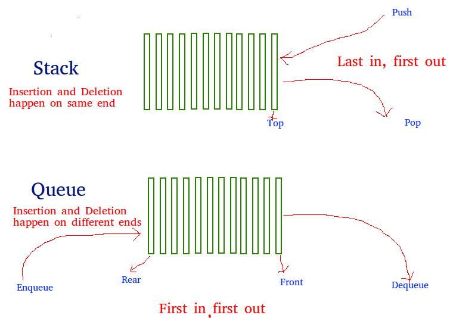

# **Create a Queue using stacks**
**Problem:**
We are given a stack data structure with push and pop operations, 
the task is to implement a queue using instances of stack data structure and operations on them.

A queue can be implemented using two stacks. 
Let queue to be implemented be q and stacks used to implement q be stack1 and stack2. 
q can be implemented in two ways:

**Method 1** **(By making enQueue operation costly)** : This method makes sure that oldest entered element is always at the top of stack 1, so that deQueue operation just pops from stack1. 
To put the element at top of stack1, stack2 is used.

**enQueue(q, x):**
1) While stack1 is not empty, push everything from stack1 to stack2.
2) Push x to stack1 (assuming size of stacks is unlimited).
3) Push everything back to stack1.

Here time complexity will be O(n)

**deQueue(q):**
1) If stack1 is empty then error
2) Pop an item from stack1 and return it