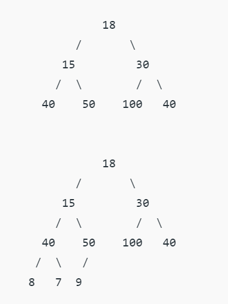

# **Complete Binary Tree**

A Binary Tree is a Complete Binary Tree if all the levels are completely filled except possibly the last level and the last level has all keys as left as possible

The following are examples of Complete Binary Trees 

`Practical example of Complete Binary Tree is Binary Heap.`

