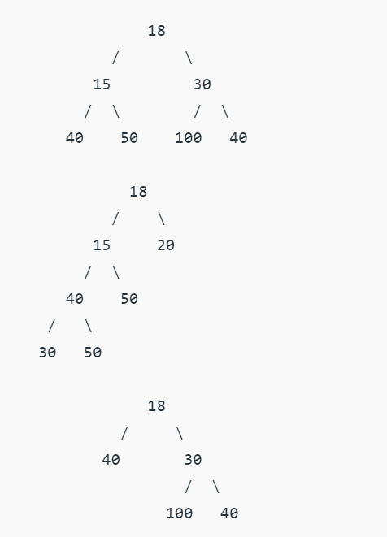

# **Full Binary Tree**

A Binary Tree is a full binary tree if every node has 0 or 2 children. The following are the examples of a full binary tree. We can also say a full binary tree is a binary tree in which all nodes except leaf nodes have two children.

