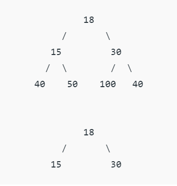

# **Perfect Binary Tree**

A Binary tree is a Perfect Binary Tree in which all the internal nodes have two children and all leaf nodes are at the same level.
The following are the examples of Perfect Binary Trees. 

In a Perfect Binary Tree, the number of leaf nodes is the number of internal nodes plus 1

L = I + 1 Where L = Number of leaf nodes, I = Number of internal nodes.

A Perfect Binary Tree of height h (where the height of the binary tree is the longest path from the root node to any leaf node in the tree) has 2h+1 – 1 node.

An example of a Perfect binary tree is ancestors in the family. Keep a person at root, parents as children, parents of parents as their children. 