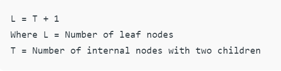

# **Binary Tree**

A tree whose elements have at most 2 children is called a binary
tree. Since each element in a binary tree can have only 2 
children, we typically name them the left and right child. 

A Binary Tree node contains following parts.
1. Data
2. Pointer to left child
3. Pointer to right child

## **Properties of Binary Tree**
**The maximum number of nodes at level ‘l’ of a binary tree is 2l :**

Here level is the number of nodes on the path from the root to the node (including root and node). Level of the root is 0.
   This can be proved by induction.
   For root, l = 0, number of nodes = 20 = 1
   Assume that the maximum number of nodes on level ‘l’ is 2l
   Since in Binary tree every node has at most 2 children, next level would have twice nodes, i.e. 2 * 2l

**The Maximum number of nodes in a binary tree of height ‘h’ is 2h – 1 :**

Here the height of a tree is the maximum number of nodes on the root to leaf path. Height of a tree with a single node is considered as 1.
This result can be derived from point 2 above. A tree has maximum nodes if all levels have maximum nodes. So maximum number of nodes in a binary tree of height h is 1 + 2 + 4 + .. + 2h-1. This is a simple geometric series with h terms and sum of this series is 2h – 1.
In some books, the height of the root is considered as 0. In this convention, the above formula becomes 2h+1 – 1

**In a Binary Tree with N nodes, minimum possible height or the minimum number of levels is? Log2(N+1) ?** 

This can be directly derived from point 2 above. If we consider the convention where the height of a leaf node is considered as 0, then above formula for minimum possible height becomes | Log2(N+1) | – 1

**A Binary Tree with L leaves has at least | Log2L? |+ 1   levels**

A Binary tree has the maximum number of leaves (and a minimum number of levels) when all levels are fully filled. Let all leaves be at level l, then below is true for the number of leaves L.

**In Binary tree where every node has 0 or 2 children, the number of leaf nodes is always one more than nodes with two children**

